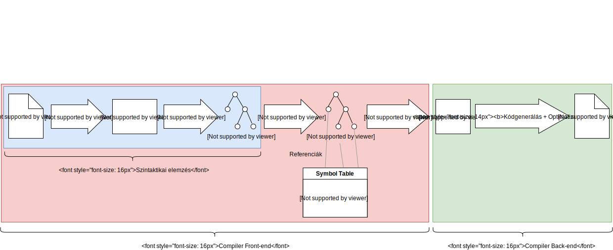

# Haladási napló: Második bejegyzés
## Célmódosítás
Előzőleg sikeresen félrenéztem az LSP képességeit, és azt hittem lehetséges már a syntax highlight tisztán a protokollból. Mint kiderült, ez még mindössze egy [proposal](https://github.com/Microsoft/language-server-protocol/pull/124). Így ehelyett első feladatomnak brace párok kiemelését tűztem ki, ezután pedig egy komolyabb fícsört (változhat, de szeretnék syntax error report-ot és go to definition-t). Hogy min múlik mi lesz az, később kifejtem.

## Compiler design 101
Mielőtt interakciókat tudnánk leírni a kliens és szerver között, meg kell nézzük hogy hogyan épül fel a szerver legfontosabb eleme, a fordító.

### A klasszikus fordítási modell
Néhány extrémet leszámítva a mai fordítók nagyjából ugyanazt a fordítási modellt követik:

Manapság divat a backend részleget egy létező megoldásra, leggyakoribb esetben például az [LLVM](https://llvm.org/)-re hagyni.

Ideális esetben a fenti pipeline folyamatok teljesen elkülönülnek, nem hatnak egymásra. A gyakorlatban néhány nyelv ennél bonyolultabb, a folyamatok visszahatnak korábbi folyamatokra - például a [C lexer hack](https://en.wikipedia.org/wiki/The_lexer_hack).

A C++ például odáig fokozza a visszahatást korábbi folyamatokra, hogy a [fordítási folyamat leállása](http://blog.reverberate.org/2013/08/parsing-c-is-literally-undecidable.html) ekvivalens a [leállási problémával](https://en.wikipedia.org/wiki/Halting_problem). Természetesen ez csak egy elvi limitáció, a gyakorlatban korlátok vannak bevezetve, mint például template példányosítási mélységhatár.

A mi esetünkben - a metaprogramozási képességeket leszámítva - a folyamatokat teljesen el tudjuk különíteni.

### Probléma a klasszikus modellel
