# Haladási napló: Második bejegyzés
## Célmódosítás
Előzőleg sikeresen félrenéztem az LSP képességeit, és azt hittem lehetséges már a syntax highlight tisztán a protokollból. Mint kiderült, ez még mindössze egy [proposal](https://github.com/Microsoft/language-server-protocol/pull/124). Így ehelyett első feladatomnak egy - másik - ergonomikus dolgot, a comment folding-ot tűztem ki, miközben ún. _token_ kiemelést is implementálok.

## Compiler design 101
Mielőtt interakciókat tudnánk leírni a kliens és szerver között, meg kell nézzük hogy hogyan épül fel a szerver legfontosabb eleme, a fordító.

### A klasszikus fordítási modell
Néhány extrémet leszámítva a mai fordítók nagyjából ugyanazt a fordítási modellt követik:
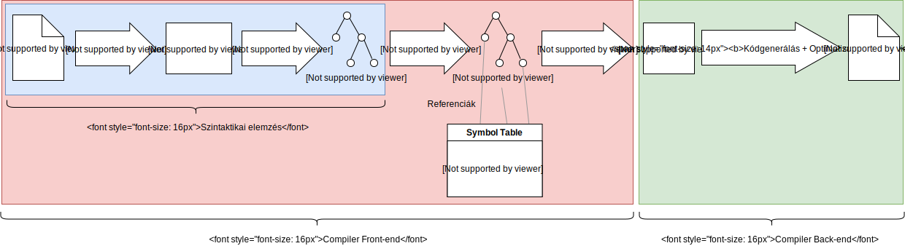
**Note:** _Sokszor nem különböztetnek meg Parse Tree-t és AST-t, mert egy és ugyanazon struktúrát használják az implementációnál. Elviekben a különbség annyi, hogy az AST nem tartalmaz fölösleges szintaktikai elemeket, illetve szemantikai információt hordoz, például referenciákat szimbólumokhoz._

Manapság divat a backend részleget egy létező megoldásra, leggyakoribb esetben például az [LLVM](https://llvm.org/)-re hagyni.

Ideális esetben a fenti pipeline folyamatok teljesen elkülönülnek, nem hatnak egymásra. A gyakorlatban néhány nyelv ennél bonyolultabb, a folyamatok visszahatnak korábbi folyamatokra - például a [C lexer hack](https://en.wikipedia.org/wiki/The_lexer_hack).

A C++ például odáig fokozza a visszahatást korábbi folyamatokra, hogy a [fordítási folyamat leállása](http://blog.reverberate.org/2013/08/parsing-c-is-literally-undecidable.html) ekvivalens a [leállási problémával](https://en.wikipedia.org/wiki/Halting_problem). Természetesen ez csak egy elvi limitáció, a gyakorlatban korlátok vannak bevezetve, mint például template példányosítási mélységhatár.

A mi esetünkben - a metaprogramozási képességeket leszámítva, mely erősen túlmutat a jelenlegi célok keretein - a folyamatokat teljesen el tudjuk különíteni.

### Probléma a klasszikus modellel
A legtöbb nyelvi segédeszköznek - mint ami az editorokban is van - a fordító front-endjét kell használniuk, a felhasználói hibák a legtöbb esetben itt történnek. Azonban ha minden egyes karakter változására lefutna a teljes folyamat, az nagyon lassú és pazarló volna. Szükséges, hogy a front-end képes legyen csak a változásokra reflektálni.

_Az egyszerűség kedvéért ezt a részét mellőzöm a projektnek, de megemlítek módszert mely alkalmazható._

A másik probléma, hogy a klasszikus fordítókat feketedobozként írták. Ez jó volt akkor, amikor ténylegesen csak parancssori alkalmazásokként használták őket, azonban - mint előbb láthattuk - megszületett az igény, hogy a front-end aktív kommunikációt végezzen egy protokollon keresztül. Szükséges tehát, hogy a fordítónak legyen egy API formája, melyen keresztül elérhetünk szintaktikai, referenciális illetve diagnosztikai információt (és még sok mást).

## Projekt architektúra
Mielőtt elkezdünk foglalkozni a fordítás első lépésével, érdemes a projekt architektúráját közelebb vigyük valami célnak megfelelőbb formába.

Jelenleg a projekt 2 modulból áll: egy nyelvi szerverből - mely főként egy LSP framework - illetve egy nyelvi kliensből VS Code-hoz. Ez azt jelenti, hogy a nyelvi szervert összekötöttük az LSP framework-kel, ami prototípusok készítésére kényelmes lehet, de nem segíti az újrafelhasználhatóságot.

### Az új architektúra:
- **LSP framework**: A nyers LSP kommunikációt és üzeneteket rejti ela tényleges nyelvi szerver elől. Biztosít egy absztrakt interfészt, melyet a nyelvi szervernek implementálnia kell, ezen keresztük magas szinten használhatja a protokollt. Ez a modul csak akkor változik, ha a protokollban új üzenetet akarunk lekezelni, mert például új specifikáció jelent meg.
- **Compiler (framework)**: A nyelv lényegi implementációja. Implementálja a fordítási fázisokat és ehhez programozói felületet biztosít. Csak akkor változik, ha a nyelven vagy valamelyik fázisán változtatni akarunk. Nekünk most csak a front-end része kell, ez hasznos a nyelvi szerver szempontjából.
- **Language Server**: A nyelv folyamatos fordításával és az abból lekért információkból üzeneteket alkot, melyeket a nyelvi kliensnek küld. Figyeli a nyelvi kliens üzeneteit, azokra reagál. Akkor változik, ha változtatni akarunk a nyelvi segéden, vagy újabb fícsörrel akarjuk könnyíteni az adott nyelvben való kódolást.
- **Language Client(s)**: Egyszerű, pár soros plug-inok az editorokhoz. Feladatuk elindítani a nyelvi szervert és beállítani a kommunikáció módját. Ebben a projektben jelenleg csak VS Code-hoz van ilyen. Ha egyszer megírtuk, általában nem változik.

### Az új architektúra függőségi gráfja:
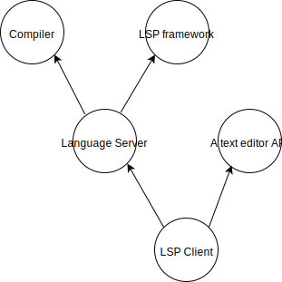

Ez egy előnyös felépítés, a compiler, editor API és a protokoll (így a framework is) viszonylag ritkán változik, így a függőségek stabil irányba mutatnak. Bár a nyelvi kliens függ a szervertől, általában a változás nem érinti a klienst.

## A fordítás első fázisa: Lexikális analízis
A lexikai elemzést az ún. _Lexer_ végzi. Elméletben ezt egy egyszerű [állapotgép](https://en.wikipedia.org/wiki/Deterministic_finite_automaton) is el tudja végezni, és célja egyszerűsíteni a szintaktikai elemzést. Klasszikus esetben ignorálja a szöveg azon részeit, melyek nem fontosak a nyelvtannak (szünet, új sor, komment, stb) és normalizálja azokat a lexémákat, melyeknek akár végtelen karakteres reprezentációja lehet - mint például a számok vagy változónevek.

A lexikális analízis végcélja egy _token_ sorozat előállítása. Egy token lényegében egy egységnyi része a nyelv nyelvtanának, pontosabban definiálva a token nem más, mint a nyelvtan [terminálisainak](https://en.wikipedia.org/wiki/Terminal_and_nonterminal_symbols) összessége. Ilyen egy brace, egy név, egy zárójel, stb. A lexer implementációja az alábbi file-okban található:
- [lexer.hpp](../compiler/src/yk/lexer.hpp)
- [lexer.cpp](../compiler/src/yk/lexer.cpp)

A klasszikus esettől két ponton térünk el ebben a lépésben:
- Az analízisnél eltároljuk a kommenteket is mint tokenek, bár szintaktikai elemzésnél ignorálni fogjuk. Erre azért van szükség, hogy a kommentekre is tudjunk műveleteket definiálni az editorban (pl. összecsukás).
- A nyelv megenged rekurzív kommenteket. Emiatt ennek a tokennek a nyelve ekvivalens az anbmcn nyelvvel, ami már nem ismerhető fel állapotgéppel. Helyette, ebben a lépésben egy nagyon leegyszerűsített [DPDA](https://en.wikipedia.org/wiki/Deterministic_pushdown_automaton)-t használunk - a stack helyett gyakorlatilag csak egy mélységszámláló van.

## Fícsörök az első fázisból
Bár a lexikális analízis sok információt nem ad, néhány fícsört máris implementálhatunk a nyelvi szerverbe.

### Kattintásra a teljes token kiemelése
Ha kattintunk, szeretnénk a teljes terminálist kiemelve látni. Így például egy komment is teljes egészében ki lesz emelve ahelyett, hogy egyetlen szót emelnénk ki belőle. Miután jeleztük a képességet a kliens felé, annyi a dolgunk, hogy válaszolunk a [document highlight request](https://microsoft.github.io/language-server-protocol/specification#textDocument_documentHighlight)-ekre. A válasznak az összes kiemelés intervallumát (sor és oszloppal leírva) tartalmaznia kell. A request tartalmazza, hogy éppen hol áll a kurzor, így bejön egy újabb szokatlan fícsör: visszakeresni egy tokent pozíció alapján.

Az implementáció előtt:

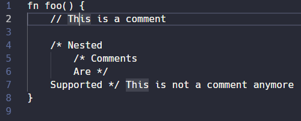
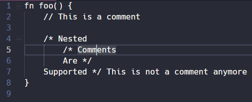

Implementáció után:

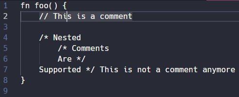
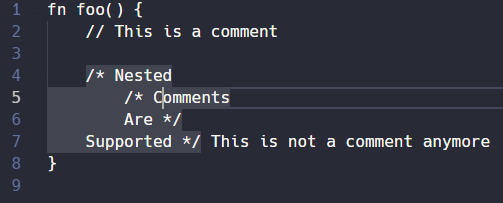

### Többsoros kommentek összecsukása
Mivel a nyelvben rekurzív kommentek vannak, a VS Code-ba (és a legtöbb editorba) beépített összecsukási mechanizmus egyszerűen félrevezető. Összecsukás előtt:

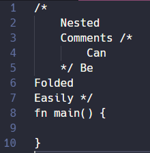

Összecsukás után:

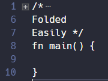

A protokollban mindössze jeleznünk kell a képességet, ezután minden kódbéli változásnál kapunk egy [folding range request](https://microsoft.github.io/language-server-protocol/specification#textDocument_foldingRange)-et. Válaszul az összes összecsukható elem intervallumát meg kell adjuk. Jelen esetben elég, ha az összes többsoros komment token intervallumát adjuk válaszul. Az eredmény:

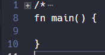

### Hiba: Nem várt karakter
Minden hiba, warning és hint visszajelzése diagnostic leírásokkal történik. A szerver egy [publish diagnostics](https://microsoft.github.io/language-server-protocol/specification#textDocument_publishDiagnostics) üzenetben le kell írja az összes diagnosztikai információt, melyet az adott file-hoz kíván csatolni. A kliens nem képes diagnosztika halmozására, mindig az összes megjelenítendő információt kell elküldeni.

Az előző két fícsörnél talán hasznosabb, ha hiba visszajelzéseket adunk. Egy nagyon egyszerű - még parser-t nem igénylő - szintaktikai hiba például ha olyan karakter kerül a forrásba, mely ott nem szerepelhet a lexikai szabályok szerint.

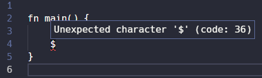

### Hiba: Lezáratlan komment
Mivel a nyelv támogat egymásba ágyazható - rekurzív - kommenteket, érdemes jelezni, ha egy komment nem lett lezárva a file vége előtt, és ha ez történt, milyen mélységben jár a komment.

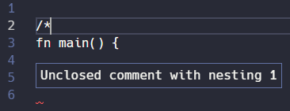
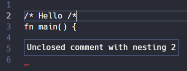

## Hova tovább?
A lexikai rész alapjai ezzel kimerültek visszajelzés szempontjából. A következő fordítási fázisban - elemzés/parsing -  visszajelezhetünk olyan hibákat, melyeket kezdő vagy gyakorlatlan programozók sokat követnek el. Ilyenek a lehagyott pontosvessző, bezáratlan zárójelpár, stb. Mindenek előtt dizájnolnunk kell egy AST-t, és meg kell válasszuk az elemző metódusunkat.
