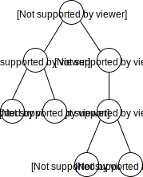

# Haladási napló: Harmadik bejegyzés
## Az AST dizájn és problémái
A fordítás egyik legfontosabb struktúrája kétségkívül az [absztrakt szintaxisfa](https://en.wikipedia.org/wiki/Abstract_syntax_tree), vagy röviden AST (Abstract Syntax Tree). Az elemző a nyelvtani szabályok alapján állítja elő*, tükrözi a nyelv struktúráltságát. Mint ahogyan neve is sugallja, egy fa struktúráról van szó.

*: Néha az elemző egy, az AST-hez nagyon hasonló struktúrát állít elő, melyet [konkrét szintaxisfának](https://en.wikipedia.org/wiki/Parse_tree) hívunk - angolul Parse Tree. Ez tartalmazhat esetleges köztes csomópontokat illetve fölösleges terminálisokat, de ezeket leszámítva AST-nek tekinthetjük.

A klasszikus AST csomópontjai nyelvtani szabályok - például elágazási szabály -, levelei pedig a lényeges terminálisok a forrásban. Ilyen egy szám, egy azonosító vagy egyéb literál. Példaképp, egy kód és a lehetséges hozzá tartozó AST:
```
if (x > y) {
    y += 5;
}
```


Amint elkészült, a szintaxisfa több átalakításon is keresztülmehet, egészen az IR kód generálásáig ezzel dolgozik a fordító. Éppen emiatt fontos, hogy a struktúra időtálló legyen, hiszen egy változtatás több lépést is érinthet egyszerre.

A lépések alatt történhet szintaktikai átalakítás, mikoris egy csomópontot lecserélünk egy vagy több másikra - ilyen például a [desugaring](https://en.wikipedia.org/wiki/Syntactic_sugar) -, de fűzhetünk szemantikai információt a levelekhez/csomópontokhoz - a teljes szemantikai elemzés ezt csinálja.

**Fontos kérdés:** Hogyan ábrázoljuk a szükséges struktúrákat úgy, hogy tükrözze a fordítási folyamat állását, könnyen bővíthető legyen, állja a változást és még a használata is kényelmes legyen?

A meglévő probléma - egyelőre még csak elvi kérdés - mellé még bejön az, hogy a diagnosztikai üzenetekhez pozíciókat is kell tárolnunk a levelekhez. Viszont nem bízhatunk abban, hogy pozícionális információ mindenhol rendelkezésre fog állni, az injektált elemeknek például nem is lehet - tipikusan metaprogramozásból eredő elemek.